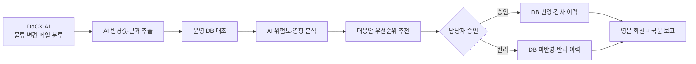

# CLOVIS MOVE.AI

> 분류된 물류 변경 메일을 **운영 가능한 의사결정**으로 바꾸는 AI 물류 커뮤니케이션 워크벤치

CLOVIS MOVE.AI는 사내 DoCX-AI가 `운송 지연/물류 변경`으로 분류한 메일을 받아,
메일 속 변경값을 운영 DB와 대조하고 위험도·대응안을 제시합니다. 담당자가 최종
승인하면 영문 파트너 회신과 국문 내부 보고까지 한 흐름으로 연결합니다. 동시에
Receiver와 독립된 Sender 루틴으로 회신·보고·요청 등 반복 사내 메일도 자동화합니다.

이 프로젝트는 현대글로비스 물류 해커톤을 위한 로컬 실행형 MVP입니다.

## 해결하려는 문제

현업 물류 메일은 정해진 양식 없이 가격, 선복, 위치, 일정, 통관, 파손 등 여러
내용이 섞여 들어옵니다. 담당자는 메일을 읽고 변경된 값만 찾은 뒤 운영 DB를
수기로 수정하고, 영향도를 판단해 관계자에게 다시 보고해야 합니다.

CLOVIS MOVE.AI는 분류 자체를 중복 개발하지 않고 **분류 이후의 판단·승인·소통**에
집중합니다.

## 핵심 흐름



## 주요 기능

| 영역 | 기능 | 설명 |
| --- | --- | --- |
| 수신 | 비정형 변경 추출 | 선명, 호출부호, ETA, 경로, 화물량과 원문 근거를 구조화합니다. |
| 수신 | DB 변경안 | 메일값과 기존 운영 DB를 필드 단위로 비교해 변경 후보만 표시합니다. |
| 판단 | 위험·영향 분석 | 일정 변경폭, 입항 임박, 용량, 데이터 품질 등을 바탕으로 위험과 근거를 제시합니다. |
| 판단 | 대응안 추천 | 기존 운송 유지, 대체 선박, 긴급 항공, 일부 항공, 납기 재협의를 우선순위화합니다. |
| 통제 | Human-in-the-loop | 담당자 승인 전에는 운영 DB가 변경되지 않습니다. 반려도 감사 이력에 남습니다. |
| 발신 | 커뮤니케이션 패키지 | 해외 파트너 영문 회신과 내부 보고용 한국어 요약을 동시에 생성합니다. |
| 검증 | Communication Guard | 누락·미정 표현·최종 검토 여부를 확인하고 발송 준비도를 표시합니다. |
| 반복업무 | 일반 메일 작성 | 회신, 업무보고, 협조 요청, 일정 변경 등 7개 템플릿을 제공합니다. |

### 독립 Sender 업무 루틴 7종

`메일 회신 · 업무보고 · 협조 요청 · 일정 변경 안내 · 회의 결과 공유 · 자료 제출 요청 · 이슈 보고`

업무 유형에 따라 입력폼과 프롬프트 규칙이 자동으로 바뀌며, 필수값 검사, 중요도 자동
판정과 수동 변경, 제목의 `[중요]` 표시, 인사말·소속·요청·감사·서명·핵심값 반영 검증을
제공합니다. 따라서 Receiver 분석을 거치지 않는 일상 반복업무에도 독립적으로 사용할 수 있습니다.

## 서비스 화면

- **수신 워크벤치**: 변경 메일 입력 → 추출 → DB 대조 → 위험/대응 판단 → 승인/반려
- **우선순위 대시보드**: 일정 변경폭, 화물량 변경률, 입항 임박도 기준 업무 정렬
- **변경 이력**: 승인/반려 결과와 변경 필드, 메일 근거 감사 추적
- **발신 스튜디오 연계 모드**: 수신 분석 인계 → 영문/국문 초안 편집 → 최종 검토 → 복사/TXT 저장
- **발신 스튜디오 루틴 모드**: 7종 업무 선택 → 동적 입력 → 중요도 판정 → AI 초안 → 형식 검증

## 기술 구성

| 구분 | 사용 기술 |
| --- | --- |
| Frontend | HTML, CSS, Vanilla JavaScript |
| Receiver API | Python, FastAPI, Uvicorn |
| Sender API | Python 표준 라이브러리 기반 HTTP 서버 |
| Data | SQLite + JSON 데모 시나리오 |
| AI | OpenAI-compatible Structured Output API |
| Local integration | `localStorage` 기반 Receiver → Sender 인계 |

## 빠른 실행

### 1. 가상환경과 의존성 설치

```powershell
python -m venv .venv
.\.venv\Scripts\Activate.ps1
pip install -r backend\receiver\requirements.txt
```

### 2. AI 키 연결

발표와 실제 기능 시연은 AI API 연결 상태를 기준으로 합니다. 프로젝트 루트에서 다음과
같이 설정합니다.

```powershell
Copy-Item .env.example .env
```

`.env`에 키와 사용할 모델을 입력합니다.

```dotenv
OPENAI_API_KEY=your_key_here
OPENAI_BASE_URL=https://api.openai.com/v1
OPENAI_MODEL=gpt-4o-mini
```

> `.env`는 Git 제외 대상이며 브라우저로 전달되지 않습니다.

### 3. 한 번에 실행

```powershell
python run_local.py
```

Windows에서는 `run_local.bat`을 더블클릭해도 됩니다.

| 서비스 | 주소 |
| --- | --- |
| 시작 화면 | <http://127.0.0.1:8765/frontend/index.html> |
| 수신 워크벤치 | <http://127.0.0.1:8765/frontend/receive.html> |
| 발신 스튜디오 | <http://127.0.0.1:8765/frontend/send.html> |
| Receiver health | <http://127.0.0.1:8766/health> |

종료는 실행한 터미널에서 `Ctrl+C`를 누릅니다.

## AI 처리 원칙

1. 메일에 실제로 적힌 값만 추출하고 값마다 원문 근거를 보존합니다.
2. 찾지 못한 필드는 추측으로 채우지 않고 `extraction_failed`로 표시합니다.
3. 위험 분석에는 원문 전체가 아니라 DB 대조 후의 구조화된 확정 사실만 전달합니다.
4. 위험 점수·추천 대응과 함께 판단 이유를 반환합니다.
5. AI 결과는 제안이며 DB 반영과 실제 발송은 항상 담당자가 최종 결정합니다.
6. AI 호출에 실패하면 오류 상태를 명확히 표시하고 안전한 폴백으로 데모 중단을 방지합니다.

## 프로젝트 구조

```text
clovis-move-ai/
├── backend/
│   ├── receiver/          # 추출, DB 대조, 위험·대응, 승인/반려, 이력 API
│   └── sender/            # 커뮤니케이션/일반 메일 생성 API와 정적 서버
├── frontend/
│   ├── index.html         # 시작 화면
│   ├── receive.html       # 수신 의사결정 워크벤치
│   ├── send.html          # 발신 커뮤니케이션 스튜디오
│   └── clovis-theme.css   # 공통 디자인 시스템
├── docs/                  # 발표·아키텍처·데모 문서
├── common/                # 공용 코드 영역
├── .env.example           # AI 설정 예시
├── run_local.py           # Receiver + Sender 통합 실행
└── run_local.bat          # Windows 실행 래퍼
```

## 데모와 실서비스의 경계

현재 MVP에서 구현된 범위:

- 로컬 SQLite 기반 운영 DB 대조와 승인/반려
- 준비된 물류 변경 시나리오
- AI API 기반 실제 변경 추출·위험 분석·대응 추천·영문/국문 생성
- AI 장애 시 데모 중단을 막는 설명 가능한 안전 폴백
- 완료 사례가 아직 축적되지 않은 해커톤 환경을 위한 유사 사례 데모 데이터

추가 연동이 필요한 범위:

- Outlook/Gmail/사내 메일 시스템의 실시간 수신·발송
- 사내 DoCX-AI API와 실제 운영 DB 연결
- 완료 사례 저장소 기반 검색 및 AI 유사도 재정렬
- SSO, 권한 관리, 개인정보 마스킹, 운영 모니터링

## 발표·개발 문서

- [PPT/Notion 원고](docs/PPT_NOTION_CONTENT.md)
- [서비스 아키텍처](docs/ARCHITECTURE.md)
- [모델 및 프롬프트 설계](docs/AI_PROMPT_DESIGN.md)
- [3분 데모 가이드](docs/DEMO_GUIDE.md)
- [GitHub 업로드 가이드](docs/GITHUB_UPLOAD_GUIDE.md)

## 주의사항

- `.env`, 로컬 SQLite DB, `__pycache__`는 저장소에 올리지 않습니다.
- 정상 발표는 실제 AI 모드로 진행하며, 장애 시 폴백 전환 여부를 화면에 표시합니다.
- 유사 사례는 해커톤용 데모 데이터이며 실제 고객·운송 이력이 아닙니다.
- 생성된 메일은 실제 발송 전 담당자가 반드시 검토해야 합니다.
