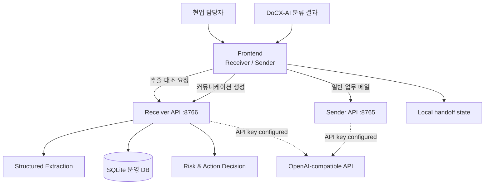
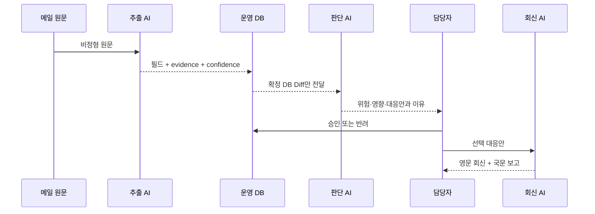

# 서비스 아키텍처

## 전체 구조

## 책임 분리

### Frontend

- `frontend/receive.html`: 메일 입력, 비교 결과, 위험/대응, 승인/반려, 이력
- `frontend/send.html`: Receiver 인계 컨텍스트, 영문/국문 편집, Communication Guard
- `frontend/clovis-theme.css`: 두 화면의 공통 디자인 시스템

### Receiver API

- 메일 추출과 JSON Schema 검증
- 선박 호출부호 기준 DB 조회
- 필드 단위 기존값/신규값 비교
- 위험도·영향·대응안 생성
- 승인/반려와 감사 이력
- 영문 회신·국문 보고 패키지 생성

### Sender API

- 7개 일반 업무 메일 템플릿
- 입력 누락과 중요도 검증
- AI 키 연결 시 실제 초안 생성
- 정적 프론트엔드 제공

## 주요 API

| Method | Endpoint | 용도 |
| --- | --- | --- |
| GET | `/api/receiver/ai-status` | Receiver AI 연결 상태 |
| POST | `/api/receiver/extract` | 메일에서 물류 필드·근거 추출 |
| POST | `/api/receiver/compare` | 운영 DB와 추출값 대조 및 의사결정 생성 |
| POST | `/api/receiver/approve` | 변경안 승인과 DB 반영 |
| POST | `/api/receiver/reject` | 변경안 반려 이력 저장 |
| POST | `/api/receiver/response-package` | 영문 회신·국문 보고 생성 |
| GET | `/api/receiver/dashboard` | 우선순위 대시보드 |
| GET | `/api/receiver/history` | 승인/반려 이력 |
| GET | `/api/sender/ai-status` | Sender AI 연결 상태 |
| GET | `/api/sender/staff/templates` | 일반 메일 템플릿 목록 |
| POST | `/api/sender/staff/generate` | 일반 업무 메일 생성 |

## AI 경계

메일 원문은 추출 단계에서만 사용합니다. 위험·대응 단계에는 DB 대조 후 구조화된
사실만 전달하여 메일 본문 속 악성 지시가 다음 단계에 영향을 주는 범위를 줄입니다.

## 데이터와 배포 경계

- 현재 데이터 저장소는 로컬 SQLite입니다.
- `receiver.db`는 런타임 생성 파일이므로 Git에 포함하지 않습니다.
- `ships_seed.json`과 시나리오 JSON은 재현 가능한 데모를 위해 포함합니다.
- 현재 서비스는 로컬 MVP이며 실제 사내 메일·DB·SSO와 연결되어 있지 않습니다.

